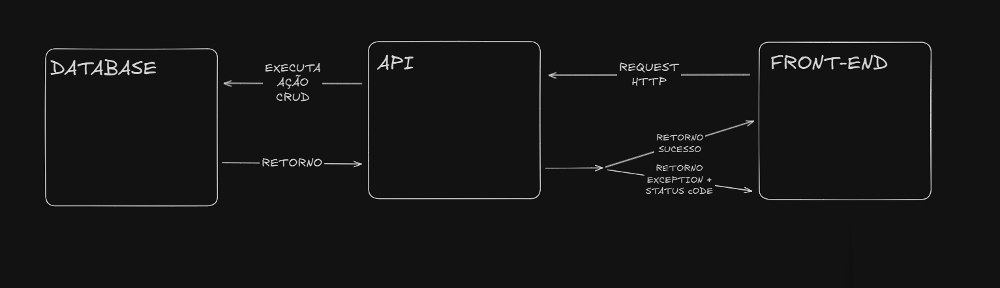

# Teste Técnico - Viceri-Seidor

*Explicações sobre a aplicação*

- **Arquitetura Backend**: Optei pela Arquitetura Limpa (Clean Architecture) seguindo os padrões de separação em camadas (API, Domain, Application, Infrastructure), definindo responsabilidades claras entre cada camada. Separei as ações do usuário nos Controllers e as regras de negócio nos Services/Repositories, demonstrando conhecimento em padrões de desenvolvimento para uma posição de Trainee.

- **Padrão Repository**: Implementei o padrão Repository para abstrair o acesso aos dados e manutenção do código. Cada entidade possui seu próprio repositório com operações CRUD específicas.

- **DTOs**: Utilizei DTOs para transferência de dados entre as camadas, garantindo que apenas os dados necessários sejam expostos.

- **Tratamento de Exceções**: Criei exceções customizadas (BadRequestException, NotFoundException, AlreadyExistsException) para um tratamento de erros mais específico e informativo, melhorando a experiência do desenvolvedor que consome a API.

- **Frontend Angular**: Desenvolvi uma aplicação SPA (Single Page Application) utilizando Angular 19 com componentes e services para comunicação com a API.

## Utilizando o Projeto...

*-> BACKEND*
- Em primeiro lugar, é necessário alterar a ConnectionString em `SuperHeroi.API > Appsettings.JSON`
```bash
"ConnectionStrings": {
  "DefaultConnection": "Server=SEU_SERVIDOR;Database=SEU_DATABASE;RESTANTE_DA_CONNECTIONSTRING;"
}
``` 
- Logo em seguida o projeto deve ser iniciar via CLI ou na IDE, após a aplicação ser compilada deverá ser aberto o Swagger na URL: 
```bash
https://localhost:44346/swagger
``` 
*-> DATABASE*

- Eu optei utilizar o Microsoft SQL Server por questões de familiaridade. As queries para serem executadas e serem realizados testes estão sendo disponibilizadas no arquivo `QueriesSqlServer.txt`.

*-> FRONTEND*
- Abrir a pasta no seguinte caminho: ../frontend/SuperHeroiFront
- Dentro da pasta basta executar um dos seguintes comandos no terminal:
```bash
ng serve
npm start 
```
- Após iniciada a aplicação ira ser aberta na URL:
```bash
- http://localhost:4200
```

## ENDPOINTS

*-> SuperHeroi*

- /api/SuperHeroi/ObterTodosSuperHerois (GET)
- /api/SuperHeroi/ObterSuperHeroi/{id} (GET)
- /api/SuperHeroi/RegistrarSuperHeroi (POST)
- /api/SuperHeroi/AtualizarSuperHeroi/{id} (PUT)
- /api/SuperHeroi/DeletarSuperHeroi/{id} (DELETE) 

*-> SuperPoderes*
- /api/SuperPoderes/ObterTodosSuperPoderes (GET)
- /api/SuperPoderes/RegistrarSuperPoder (POST)

## FLUXO DE UMA REQUISIÇÃO



## EXTRAS

- A aplicação Angular foi desenvolvida na versão 19 e API .NET na versão 3.1
- A aplicação .Net está configurada para no seguinte url => https://localhost:44346
- A aplicação Angular está utlizando a seguinte URL para o Backend -> https://localhost:44346
- O swagger do .NET está na url => https://localhost:44346/swagger/index.html
